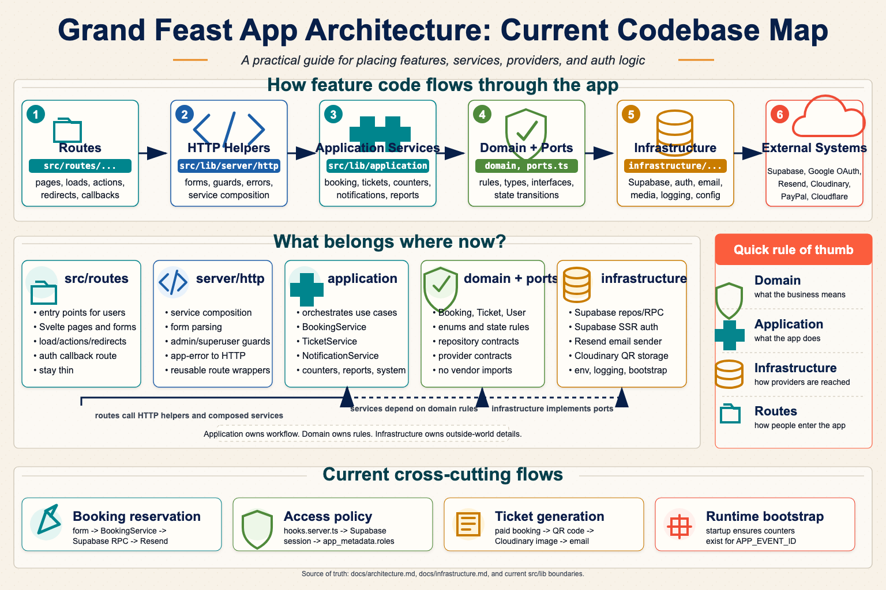
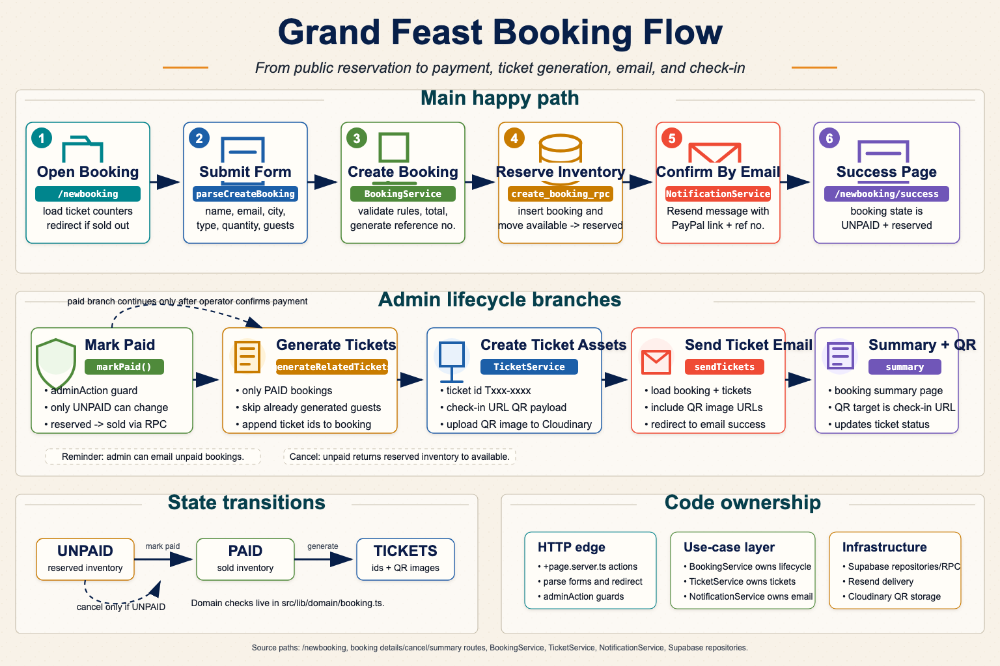

# Grand Feast EU/UK Ticketing

SvelteKit app for the Grand Feast EU and UK ticketing and admin site. The active public
sales page is currently the 2026 Dublin event, while the 2025 Oslo event remains available
as an archive/portfolio page.

## Environments

- Production: [grandfeast.eu](https://www.grandfeast.eu/)
- Development preview: [dev.grandfeast.eu](https://dev.grandfeast.eu/)
- Development branch origin:
  [dev--grand-feast-uk-x-europe.netlify.app](https://dev--grand-feast-uk-x-europe.netlify.app/)
- Production branch deploy:
  [prod--grand-feast-uk-x-europe.netlify.app](https://prod--grand-feast-uk-x-europe.netlify.app/)

Operational rule: live-dev is the required pre-production gate. The `dev` branch should
be equal to or ahead of `prod`, and production deploys should promote commits that have
already been deployed and verified on live-dev. Hosted deploys are triggered by pushing
the watched Git branches: `dev` for live-dev and `prod` for live-prod.

## Infographics





## Quick Start

Requirements:

- Node.js and npm
- Docker, for the Supabase CLI local stack
- Supabase CLI, for local database/auth development

Install dependencies and create a local env file:

```bash
make install
cp .env.example .env
```

For normal local database/auth development, point `.env` at the local Supabase CLI stack,
then run:

```bash
make run-local
```

For frontend-only work where database/auth behavior is not needed:

```bash
make run
```

The local app expects `http://localhost:5173`, including for OAuth callback URLs.

## Common Commands

```bash
make run-local        # start local Supabase, seed local auth, and run the app
make run              # start the Vite dev server
npm run check         # Svelte and TypeScript validation
npm run test          # Vitest once
npm run test:e2e      # Playwright e2e; requires make run-local already running
npm run lint          # Prettier check and ESLint
npm run build         # production build
```

## Project Structure

- `src/routes/` contains SvelteKit routes.
- `src/lib/ui/components/` contains UI-facing Svelte components.
- `src/lib/publicEvents.ts` contains public event page registry/configuration.
- `src/lib/domain/` contains framework-light domain models and business rules.
- `src/lib/application/` contains application services and ports.
- `src/lib/infrastructure/` contains adapters for auth, bootstrap, config, Supabase, email,
  logging, media, and system settings.
- `src/lib/server/http/` contains server-side HTTP service composition.
- `src/lib/navigation/` contains navigation metadata.
- `static/` contains static assets.

## Routing And Theming

- Public event pages are event-scoped under `/events/<event_id>`.
- The public events index lives at `/events`, uses a neutral theme, and lists only events
  with registered public pages.
- Public booking is event-scoped at `/events/<event_id>/newbooking`.
- `/admin` is a neutral directory of admin routes available to the signed-in user.
- Event admin pages are event-scoped under `/admin/events/<event_id>` and require
  event-specific admin grants.
- Global admin pages live under `/admin/global` and require `superuser`; v1 global tools
  include read-only event records and admin/tester user visibility.
- Global auth stays outside event scope at `/signin` and `/auth/callback`; redirects carry
  the original admin or event URL through `redirectTo`.
- Public event marketing pages use independent Svelte components under
  `src/lib/ui/components/public/events/` so archived and future events can have distinct
  designs.
- Admin event pages use DB-backed event theme colors from the `events` table to help
  operators distinguish which event they are managing.

## Admin Inventory

Ticket inventory is DB-driven. `ticket_types` defines event ticket configuration, while
`ticket_counters` stores mutable inventory. Public booking shows active available ticket
types; admin pages show all counters for the managed event.

## Audit Trail

Important domain actions are written server-side to `grandfeasteu.audit_events`. Audit
rows are durable first-party app data, scoped to an event when applicable, and loaded in
admin history UI only after an explicit `?load_history=true` request.

## Permissions Model

Authorization uses Supabase Auth `app_metadata`, not user-editable `user_metadata`.
Global roles live in `app_metadata.roles`; event admin grants live in
`app_metadata.event_roles`. `/admin` lists routes available to the signed-in user,
`/admin/events/<event_id>` requires that event's admin grant or `superuser`, and
`/admin/global` is superuser-only.

Codex service-account access uses the same Supabase Auth and app authorization model as
human operators. Hosted email/password login is enabled only when the deploy context sets
`ENABLE_EMAIL_PASSWORD_AUTH=true`; service-account passwords stay in local untracked
`.env` files or a password manager, not in Netlify.

## Documentation

- Architecture map: [`docs/architecture.md`](docs/architecture.md)
- Local development and auth setup: [`docs/local-development.md`](docs/local-development.md)
- Infrastructure, deployment, DNS, Supabase, OAuth, Resend, and Cloudinary:
  [`docs/infrastructure.md`](docs/infrastructure.md)
- Agent instructions: [`AGENTS.md`](AGENTS.md)
