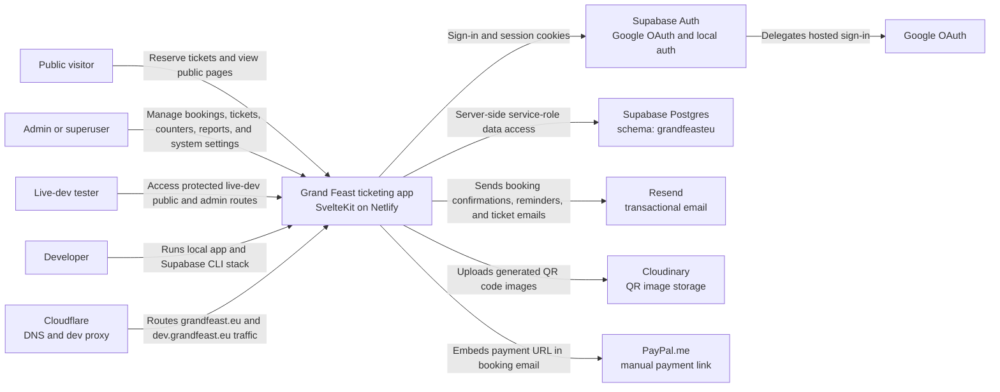
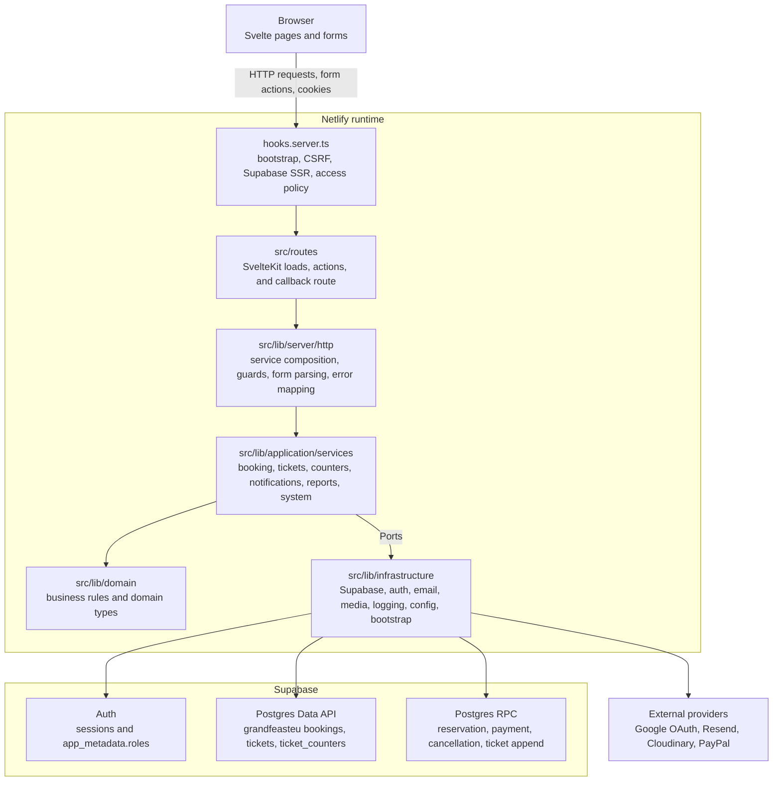
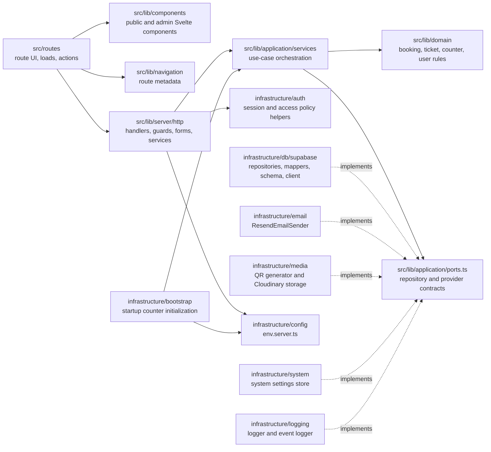
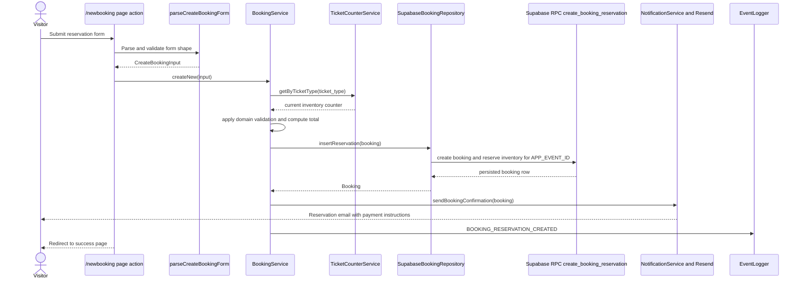
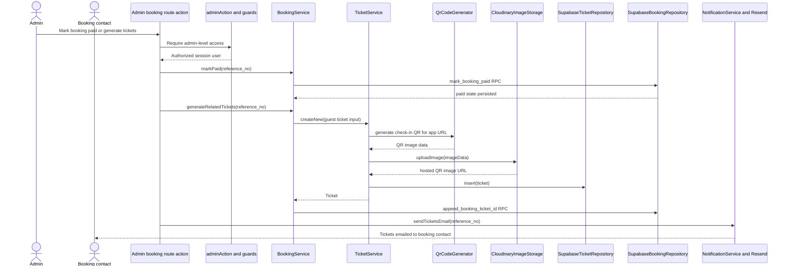
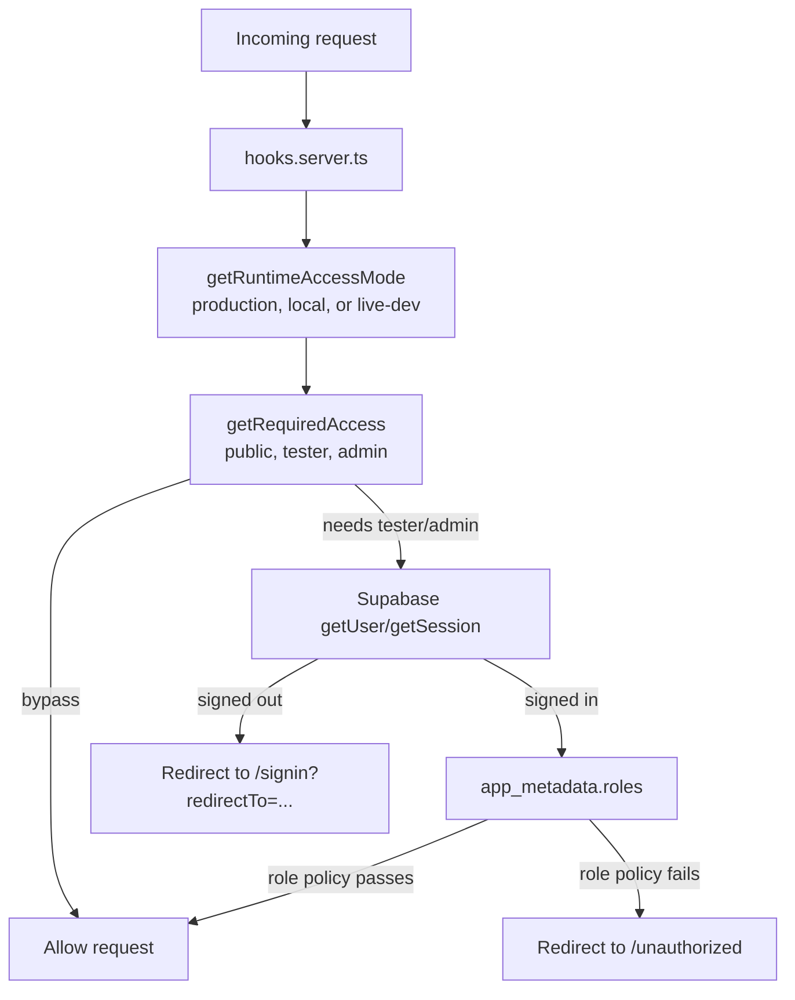

# Architecture Map

This document uses C4-style views to make the codebase easier to navigate. It is not an
exhaustive inventory of every route or class. Instead, it shows the main runtime
boundaries, dependency direction, and flows that explain where new work usually belongs.

Visual overview:
[`grand-feast-architecture-infographic-v2.png`](grand-feast-architecture-infographic-v2.png).

Booking flow overview:
[`booking-flow-infographic-v1.png`](booking-flow-infographic-v1.png).

## Level 1: System Context



## Level 2: Container View



## Level 3: Main Code Components



## Dependency Rules

- `src/routes/` adapts HTTP, page load, and form action concerns into application calls.
- `src/lib/components/` renders UI and should not own persistence or provider logic.
- `src/lib/application/services/` coordinates use cases and depends on domain rules plus
  ports.
- `src/lib/domain/` stays framework-light and should not import SvelteKit, Supabase,
  Resend, Cloudinary, or environment configuration.
- `src/lib/infrastructure/` contains concrete adapters for databases, auth, email, media,
  config, logging, bootstrap, and system settings.
- `src/lib/server/http/services.ts` is the composition root for ready-to-use services.
- Cross-cutting HTTP behavior belongs in `hooks.server.ts` and `src/lib/server/http/`, not
  copied across route files.

In short:

```txt
routes/components -> server/http -> application services -> domain
                                      application services -> ports <- infrastructure
```

## Key Flow: Booking Reservation



## Key Flow: Paid Booking To Tickets



## Runtime Access Model



Access policy summary:

- Production and local public pages are open.
- Production and local `/api` routes require `admin` or `superuser`.
- Live development public pages require `tester`.
- Live development `/api` routes require `tester` plus `admin` or `superuser`.
- Role checks use Supabase Auth `app_metadata.roles`, not user-editable metadata.

## Where To Put New Work

- New public or admin screens: start in `src/routes/`, reuse components from
  `src/lib/components/`, and call application services through `src/lib/server/http/`.
- New business rules: put the rule in `src/lib/domain/` first, with co-located tests.
- New use cases: add or extend an application service in `src/lib/application/services/`.
- New database behavior: add a port if the application needs a new capability, then
  implement it in `src/lib/infrastructure/db/supabase/`.
- New provider integration: define the application-facing contract in
  `src/lib/application/ports.ts`, then implement the provider in `src/lib/infrastructure/`.
- New auth or HTTP cross-cutting behavior: prefer `hooks.server.ts` or
  `src/lib/server/http/` so routes stay thin.

For environment, deployment, DNS, Supabase, OAuth, Resend, and Cloudinary details, read
[`docs/infrastructure.md`](infrastructure.md).
