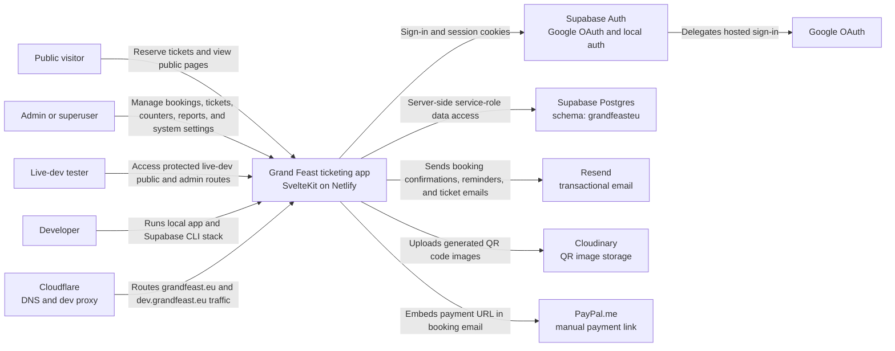
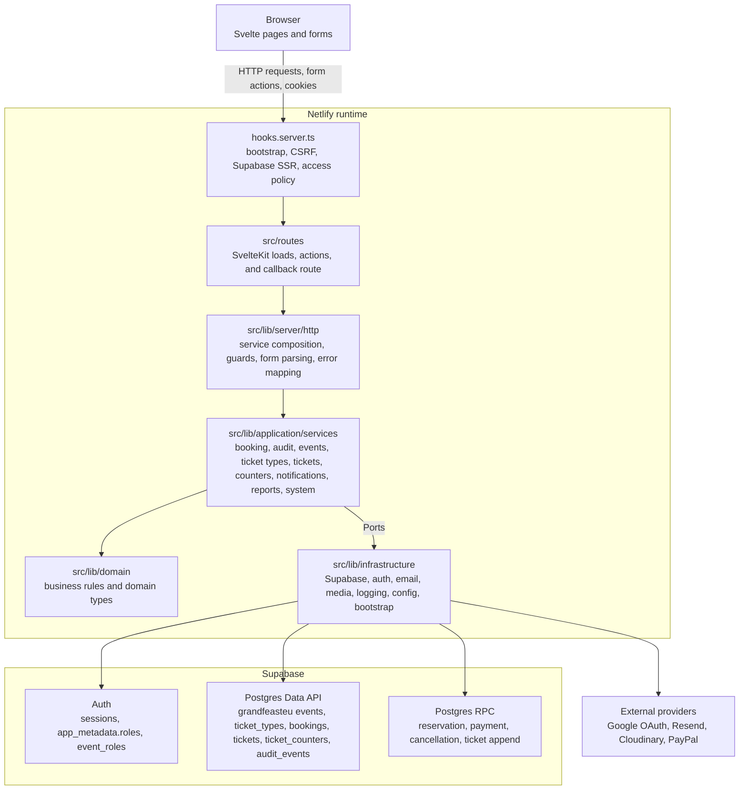
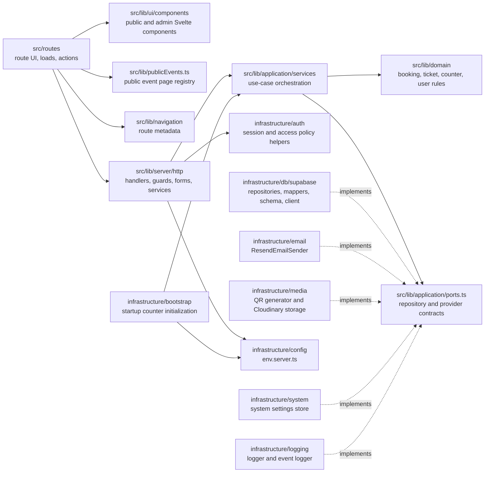
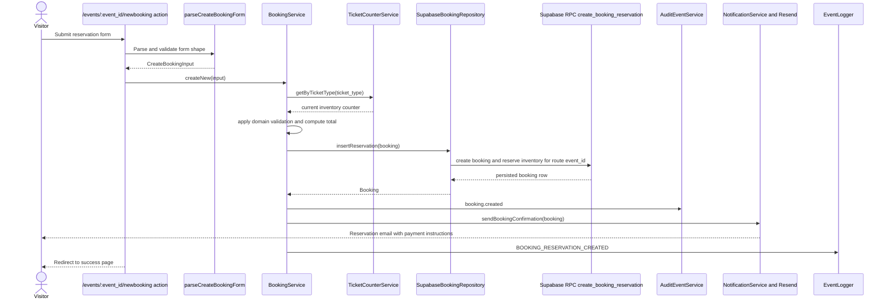
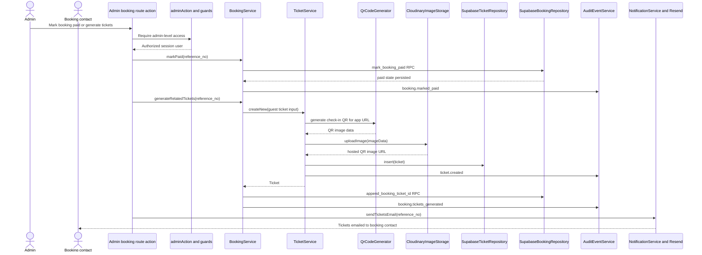
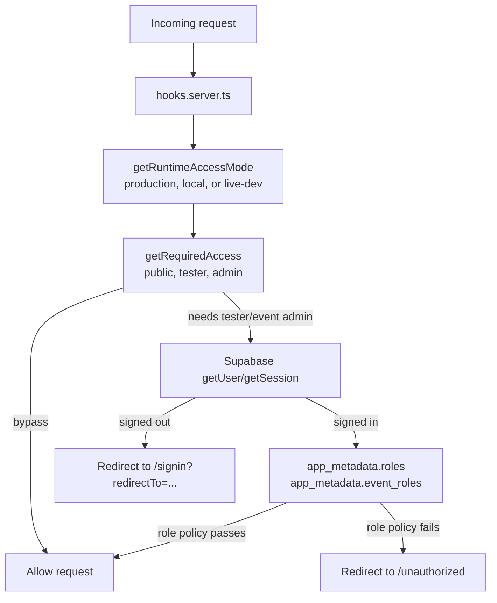

# Architecture Map

This document uses C4-style views to make the codebase easier to navigate. It is not an
exhaustive inventory of every route or class. Instead, it shows the main runtime
boundaries, dependency direction, and flows that explain where new work usually belongs.

Visual overview:
[`grand-feast-architecture-infographic-v2.png`](grand-feast-architecture-infographic-v2.png).

Booking flow overview:
[`booking-flow-infographic-v1.png`](booking-flow-infographic-v1.png).

## Level 1: System Context



## Level 2: Container View



## Level 3: Main Code Components



## Dependency Rules

- `src/routes/` adapts HTTP, page load, and form action concerns into application calls.
- `src/lib/ui/components/` renders UI and should not own persistence or provider logic.
- `src/lib/publicEvents.ts` maps event ids to public page metadata, registered event
  landing components, and archive/booking-open behavior for public routes.
- `src/lib/application/services/` coordinates use cases and depends on domain rules plus
  ports.
- `src/lib/domain/` stays framework-light and should not import SvelteKit, Supabase,
  Resend, Cloudinary, or environment configuration.
- `src/lib/infrastructure/` contains concrete adapters for databases, auth, email, media,
  config, logging, bootstrap, and system settings.
- `src/lib/server/http/services.ts` is the composition root for ready-to-use services.
- Cross-cutting HTTP behavior belongs in `hooks.server.ts` and `src/lib/server/http/`, not
  copied across route files.

In short:

```txt
routes/ui components -> server/http -> application services -> domain
                                      application services -> ports <- infrastructure
```

## Route Model

The app uses event-scoped URLs for public event pages and event admin tools, with a
separate neutral admin directory and superuser-only global admin branch:

- `/` redirects to `/events/<APP_EVENT_ID>`.
- `/events` is a global public index grouped by event year.
- `/events/<event_id>` is the public landing page for one event.
- `/events/<event_id>/newbooking` is the public booking flow for one event.
- `/events/<event_id>/privacy`, `/conditions`, and `/faq` are shared legal/help pages
  rendered in the context of one event.
- `/admin` is a neutral directory of admin routes available to the signed-in user.
- `/admin/events/<event_id>` is the admin dashboard for one event.
- `/admin/events/<event_id>/bookings`, `/tickets`, `/counters`, `/audit`, `/reports`,
  and `/system` are event-scoped admin tools.
- `/admin/global` is the superuser-only global admin branch.
- `/admin/global/events` is the read-only global event record list for v1.
- `/admin/global/users` is the read-only Supabase Auth admin/tester user directory for
  v1.
- `/signin`, `/auth/callback`, and `/unauthorized` are global auth/access routes.

Old non-root URLs such as `/newbooking`, `/api`, `/privacy`, `/conditions`, and `/faq`
are not canonical event routes. New work should use the event id from route params and
build repositories/services for that request event. `APP_EVENT_ID` is only the default
event for root redirects and setup/bootstrap defaults.

When a signed-out user opens a protected admin URL, the app redirects through global
`/signin?redirectTo=<original admin URL>` and returns to the same admin URL after
sign-in. `/admin` requires any admin-level access through `roles.admin`, at least one
`event_roles[eventId].admin`, or `superuser`. Event admin authorization remains
event-specific through `app_metadata.event_roles[eventId]`, while `/admin/global` requires
`superuser`.

## Theming Model

The app deliberately separates public marketing themes from operational admin theming:

- `/events` uses a neutral index theme and should not inherit an individual event's
  public marketing style.
- `/events/<event_id>` uses an event-specific public Svelte component registered in
  `src/lib/publicEvents.ts`; future events should get their own component under
  `src/lib/ui/components/public/events/`.
- The `/events` index loads DB event records but filters them through
  `getPublicEventPage(event_id)`, so unregistered event ids do not appear publicly and
  `/events/<event_id>` fails clearly when no public page is registered.
- `gfeu2026` is the active sales page and can keep its own marketing design and booking
  calls to action.
- `gfeu2025` is an archive/portfolio page and should not expose active booking actions.
- `/admin/events/<event_id>` pages share the admin UI but use DB-backed event theme
  colors from `events.theme_main_color`, `theme_sub_color`, `theme_highlight_color`, and
  `theme_on_main_color` to make the managed event visually obvious while scrolling.
- `/admin` and `/admin/global/*` use neutral admin styling because they are not scoped to
  one event.

## Admin UI Layout

Admin pages must remain usable on narrow mobile and split-screen viewports. Shared admin
surfaces should let content shrink with `min-w-0`, use grid tracks like
`minmax(0, 1fr)`, and wrap long operational values such as emails, reference numbers,
ticket IDs, URLs, and JSON metadata. Wide history or data tables should either become
stacked cards on small viewports or live inside an explicitly scoped overflow container;
the page itself should not horizontally scroll.

Event admin dashboard inventory cards are data-driven from the route event's
`ticket_counters` rows, joined with `ticket_types` for display labels, active state, and
sort order. Admin inventory intentionally includes inactive ticket types because inactive
means unavailable for public booking, not invisible to operators. Public booking pages
continue to load only active and currently available ticket types.

## Key Flow: Booking Reservation



## Key Flow: Paid Booking To Tickets



## Audit Trail

Durable domain audit events live in `grandfeasteu.audit_events`. The audit trail is
first-party Supabase data, not an external logging provider. Application services write
audit rows server-side after successful state changes, and audit insert failures are
logged without blocking the already-completed user action.

The audit table has a direct FK only to `events(event_id)`. It stores audited targets as
`entity_type` plus `entity_id` for bookings, tickets, and counters instead of taking
direct FKs on operational tables. This keeps the audit trail polymorphic and resilient to
future cleanup, archive, or schema reshaping of bookings and tickets.

Event admins can open `/admin/events/<event_id>/audit`, and booking/ticket details show
related history sections. Those pages do not query audit rows by default; the UI links to
the same page with `?load_history=true` before loading event or entity history.

Current audit action values are:

- `booking.created`
- `booking.payment_reminder_sent`
- `booking.marked_paid`
- `booking.cancelled`
- `booking.tickets_generated`
- `booking.tickets_email_sent`
- `booking.marked_tickets_as_sent`
- `ticket.created`
- `ticket.checked_in`
- `ticket.checked_out`
- `ticket_counter.available_added`

Audit actor types are `public`, `admin`, and `system`. Audit entity types are `booking`,
`ticket`, and `ticket_counter`. Metadata should capture useful operational context such as
ticket type, quantity, amount, generated ticket ids, and previous/new state where useful.
Ticket email sends use both `booking.tickets_email_sent` after delivery succeeds and
`booking.marked_tickets_as_sent` after the booking `tickets_sent_to_client` flag is
persisted. Metadata must not store secrets, tokens, API keys, uploaded file contents,
payment proof URLs,
or email bodies.

## Runtime Access Model



Access policy summary:

- Production and local public pages are open.
- `/admin` requires any admin-level access: `roles.admin`, at least one
  `event_roles[event_id].admin`, or `superuser`.
- Production and local `/admin/events/<event_id>` routes require
  `event_roles[event_id]` containing `admin`, or `superuser`.
- `/admin/global/*` routes require `superuser`.
- Live development public pages require `tester`.
- Live development `/admin` requires `tester` plus any admin-level access, unless the
  user has `superuser`.
- Live development `/admin/events/<event_id>` routes require `tester` plus
  `event_roles[event_id]` containing `admin`, unless the user has `superuser`.
- Role checks use Supabase Auth `app_metadata.roles` and `app_metadata.event_roles`, not
  user-editable metadata.

## Where To Put New Work

- New public or admin screens: start in `src/routes/`, reuse components from
  `src/lib/ui/components/`, and call application services through `src/lib/server/http/`.
- New public event landing pages: put event-specific Svelte components under
  `src/lib/ui/components/public/events/`, then register their public page metadata in
  `src/lib/publicEvents.ts`.
- To publish a future public event, add/seed the `events` row through a migration, add
  ticket types/counters if booking is needed, create the event component, register the
  event in `src/lib/publicEvents.ts`, and wire it in
  `src/routes/events/[event_id]/+page.svelte`.
- New event admin tools belong under `/admin/events/<event_id>` and must keep
  event-scoped authorization.
- New global admin tools belong under `/admin/global` and must require `superuser`.
- Global user maintenance starts as read-only `/admin/global/users`; future grant/revoke
  actions should stay server-only and write Supabase Auth `app_metadata`.
- New business rules: put the rule in `src/lib/domain/` first, with co-located tests.
- New use cases: add or extend an application service in `src/lib/application/services/`.
- New database behavior: add a port if the application needs a new capability, then
  implement it in `src/lib/infrastructure/db/supabase/`.
- New provider integration: define the application-facing contract in
  `src/lib/application/ports.ts`, then implement the provider in `src/lib/infrastructure/`.
- New auth or HTTP cross-cutting behavior: prefer `hooks.server.ts` or
  `src/lib/server/http/` so routes stay thin.

For environment, deployment, DNS, Supabase, OAuth, Resend, and Cloudinary details, read
[`docs/infrastructure.md`](infrastructure.md).
